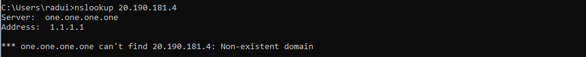

# 🔍 Investigating TCP Reset Packets in Wireshark

## 📌 Introduction
While analyzing network traffic using **Wireshark**, I noticed a suspicious TCP **RST, ACK** packet from `20.190.181.4` to my local machine. Since red-colored packets in Wireshark can indicate **connection resets or potential security concerns**, I decided to investigate further.

This write-up documents my approach, findings, and additional methods to analyze TCP resets for potential security threats. It also includes an **automated method** to detect and log unexpected TCP resets using Python.

---

## 🛠 Tools Used
- **Wireshark** (for packet capture and analysis)
- **Command Prompt / PowerShell** (for network and DNS lookup)
- **Windows Event Viewer** (to check related system events)
- **Python (Scapy)** (for automated detection, optional)
- **tcpdump** (for verifying network traffic at a lower level)

---

## 📡 Step 1: Detecting TCP Reset in Wireshark
1. Open **Wireshark** and start capturing network traffic.
2. Apply the display filter to find TCP Reset packets:
   ```
   tcp.flags.reset == 1
   ```
3. Identify the relevant packet:
   ```
   4270  9.199067  20.190.181.4  192.168.0.139  TCP  54  443 → 58119 [RST, ACK] Seq=1 Ack=1 Win=0 Len=0
   ```
   ### Wireshark Capturing TCP Reset
  

4. **Key details from the packet:**
   - **Source IP:** `20.190.181.4` (External)
   - **Destination IP:** `192.168.0.139` (My machine)
   - **Source Port:** `443` (HTTPS)
   - **Flags:** `[RST, ACK]`

---

## 🔍 Step 2: Investigating the Source IP
Since the reset packet came from an external IP, I checked its details.

### **2.1 Reverse DNS Lookup**
Using `nslookup` in **Command Prompt**:
```cmd
nslookup 20.190.181.4
```
**Result:** No domain found (non-existent domain).
### DNS lookup in cmd


### **2.2 Checking IP Ownership**
Using PowerShell to query `ipinfo.io`:
```powershell
(Invoke-WebRequest -Uri "https://ipinfo.io/20.190.181.4/json").Content
```
**Result:** IP belongs to **Microsoft Corporation (AS8075), located in Sweden**. Likely related to Azure or Windows Update.
### IP ownership check


---

## 📁 Step 3: Checking System Logs for Correlation
To verify if Windows Update was active at the time, I checked **Windows Event Viewer**.

### **Command:**
```powershell
Get-WinEvent -LogName Microsoft-Windows-WindowsUpdateClient/Operational -MaxEvents 20
```
**Result:** Multiple Windows Update events, confirming the RST packet was likely from a legitimate Microsoft service.
### System logs


---

## 🚀 Step 4: Automating Detection of Unexpected TCP Resets
To improve future analysis, I created a **Python script using Scapy** that:
- Captures network traffic in real-time.
- Logs any **unexpected TCP Reset packets** from unknown sources.

### **4.1 VirtualBox Fix: Ensuring Correct Network Capture**
If running inside **VirtualBox**, ensure:
- **Network Adapter is set to "Bridged Adapter"**
- **Promiscuous Mode is set to "Allow All"**
- **Run this command to disable packet offloading:**
  ```bash
  sudo ethtool -K eth0 rx off tx off
  ```
  *(Replace `eth0` with your actual interface)*

### **4.2 Install Dependencies**
Ensure **Scapy** is installed:
```bash
pip install scapy
```

### **4.3 Python Script to Detect TCP RST Packets**
```python
from scapy.all import sniff, IP, TCP

def detect_rst(packet):
    if packet.haslayer(TCP) and packet.haslayer(IP):
        if packet[TCP].flags & 4:  # RST flag
            print(f"[ALERT] TCP Reset from {packet[IP].src} to {packet[IP].dst} (Flags: {packet[TCP].flags})")
            with open("tcp_resets.log", "a") as log_file:
                log_file.write(f"RST from {packet[IP].src} to {packet[IP].dst} (Flags: {packet[TCP].flags})\n")

sniff(iface="eth0", filter="tcp", prn=detect_rst, store=0)
```

### **4.4 Running the Script**
```bash
sudo python3 detect_rst.py
```
If a **TCP Reset occurs**, it will log details in `tcp_resets.log`.
### Script alerts

### Wireshark alerts


---

## 🛠 Debugging Steps (If Script Doesn't Work)
1. **Confirm Scapy Sees Any Traffic:**
   ```python
   from scapy.all import sniff
   sniff(iface="eth0", filter="tcp", count=10, prn=lambda x: x.summary())
   ```
2. **Check If TCP Resets Exist in `tcpdump`**:
   ```bash
   sudo tcpdump -i eth0 'tcp[tcpflags] & (tcp-rst) != 0'
   ```
3. **Ensure Wireshark Detects Resets Simultaneously.**

---

## 🔥 Conclusion
Through **packet analysis**, **DNS lookup**, and **system logs**, I determined that the TCP Reset was from a **legitimate Microsoft server** and not a security threat.

However, similar methods can be used to detect **malicious TCP Resets**, such as:
- **Active interference (MITM attacks)**
- **Intrusion attempts**
- **Firewalls dropping connections**

This analysis improves my ability to investigate network anomalies and enhances my cybersecurity portfolio. 🚀

